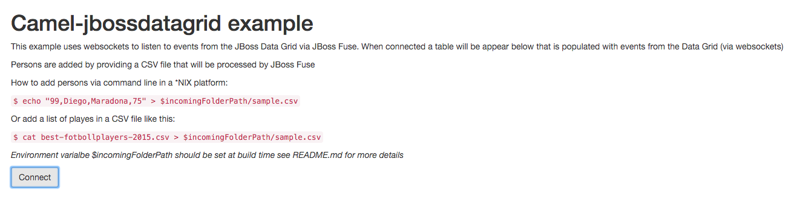
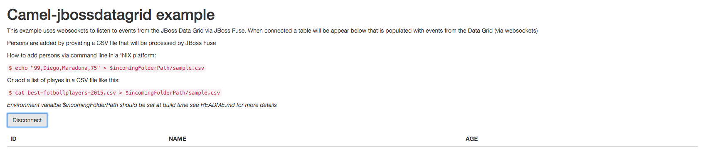
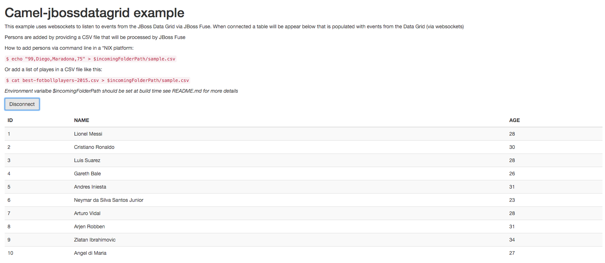
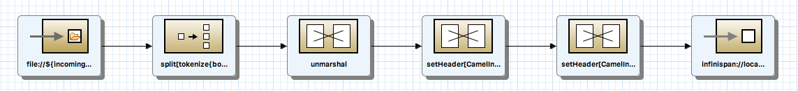
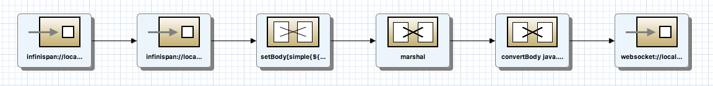

Using __camel_jbossdatagrid__ component
===========================================================
This quickstart shows how to use the __camel_jbossdatagrid__ component in Fuse 6.2.0
* Author: Vijay Chintalapati

This quickstart will deploy two bundles __local_cache_producer__ and __local_cache_consumer__ on Fuse, one on each container __child1__ and __child2__ respectivity.

* __local_cache_producer__ : Scans a folder (/tmp/incoming) for incoming CSV files of the format "id, firstName, lastName, age". If a file is dropped with entries in the given format, each entry is read and transformed into a Person POJO and stored in the data grid

* __local_cache_consumer__ : Lets you query for a POJO using a RESTful interface and get back  a JSON representation of the Person POJO stored in the data grid for the given key
 
_The bundles reside in two different containers and the reason why the consumer is able to extract what the producer has put in, is because of the use of same configuration in files: infinispan.xml and jgroups.xml on both sides. The infinispan.xml file has a **REPL (replicated)** cache definition by the name **camel-cache** and this is the cache with which the producer and consume interact_

Prerequisites
-------------
1. JDK 1.7 
2. Maven 3.0
3. JBoss Fuse 6.2.0
4. JBoss Data Grid Maven repository

Setup
-----
1. Download the Fuse binary __jboss-fuse-full-6.2.0.redhat-133.zip__ from either http://www.jboss.org/products or from Red Hat's Customer portal
2. Ensure that you have correctly setup JDG repos in your .m2/settings.xml. See the [official documentation] (https://access.redhat.com/documentation/en-US/Red_Hat_JBoss_Data_Grid/6.4/html-single/Getting_Started_Guide/index.html#chap-Install_and_Use_the_Maven_Repositories) on how to accomplish that.
3. Export the path to the folder where the CSV files will be placed by running the command of the form `export incomingFolderPath=[Full path to the CSV folder]`
4. Run `mvn clean install -DincomingFolderPath=$incomingFolderPath` in the root folder of the quickstart
5. Set the following two environment variables in the same shell: 
  1. export __FUSE_INSTALL_PATH__ = _[Full path to the folder into where Fuse will be installed]_ 
  2. export __FUSE_BINARY_PATH__ = _[Full path to the Fuse binary file]_ 
6. While in the root folder of the quickstart, run `./setupEverythingOnFuse.sh`

Setup Verification 
------------------
1. Verify your access to the [Fuse Hawtio Console] (http://127.0.0.1:8181/hawtio/index.html#/login). The __username/password__ is __admin/admin__.
2. If the __Fuse Fabric__ is created right, you should be able to access the containers [here](http://127.0.0.1:8181/hawtio/index.html#/fabric/containers)
3. Verify if you see two containers created by the names __child1__ and __child2__. Also note if root/child1/child2 are all in __green__, if they are not click on their names andcapture the logs displayed.  

Testing
-------

1. Open the index.html in a browser
   
2. Click on connect
   
2. Add the best fotboll (soccer) players 2015 by executing `$ cp best-fotbollplayers-2015.csv $incomingFolderPath/`
   
3. Check that the players was added to the table in the browser
   
4. Add another player by executing `$ echo "99,Diego,Maradona,75" > $incomingFolderPath/sample.csv`
5. Verify that another player was added to the table in the browser

It's also possible to open multiple browsers and connect them and verify that all clients get's the same updates!

How does it work
----------------
1. The local\_cache_producer will listen to incoming files in the folder $incomingFolderPath. It will transform each line in the CSV to Java object and store them in the local datagrid.
   
2. The local\_cache_consumer will react to events that an entry has been added to the datagrid and will retrieve the Java object, transform it to JSON and push it to WebSocket clients that are connected.   
   
