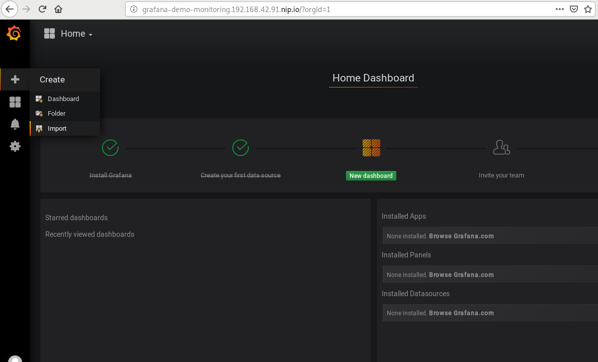
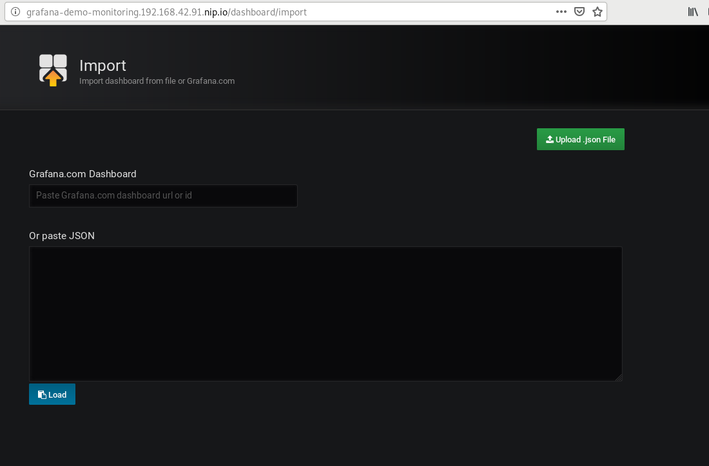
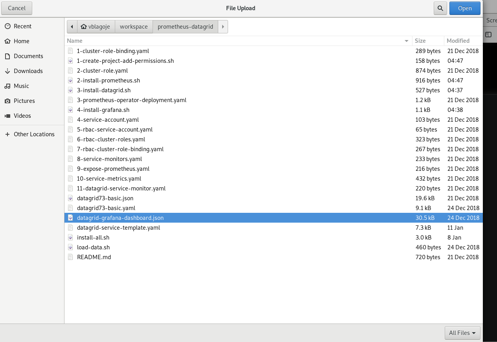
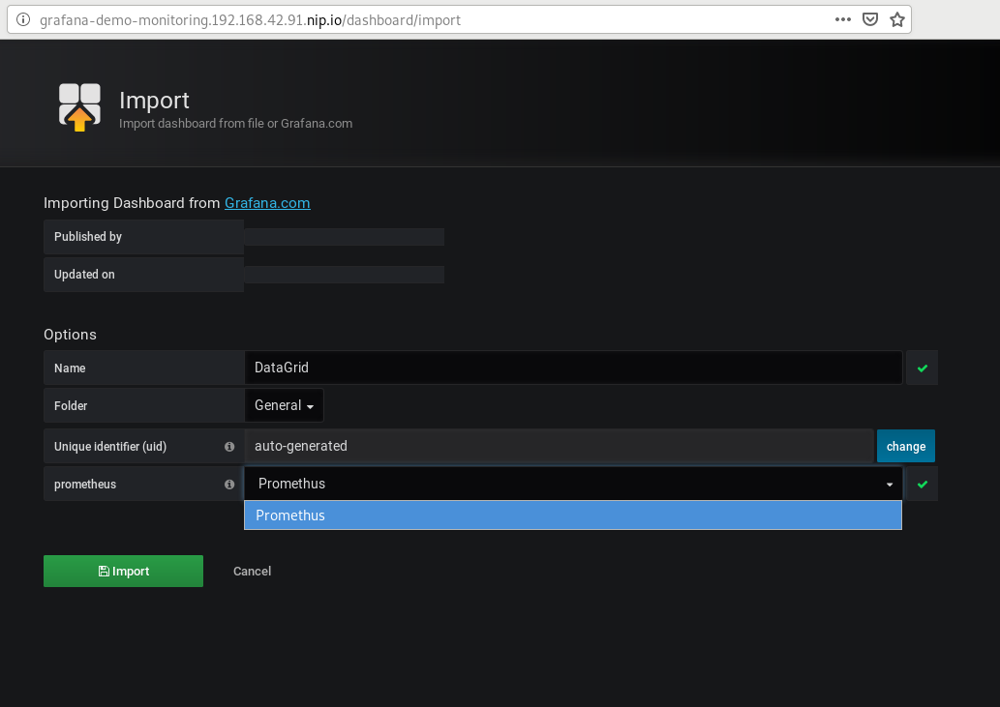
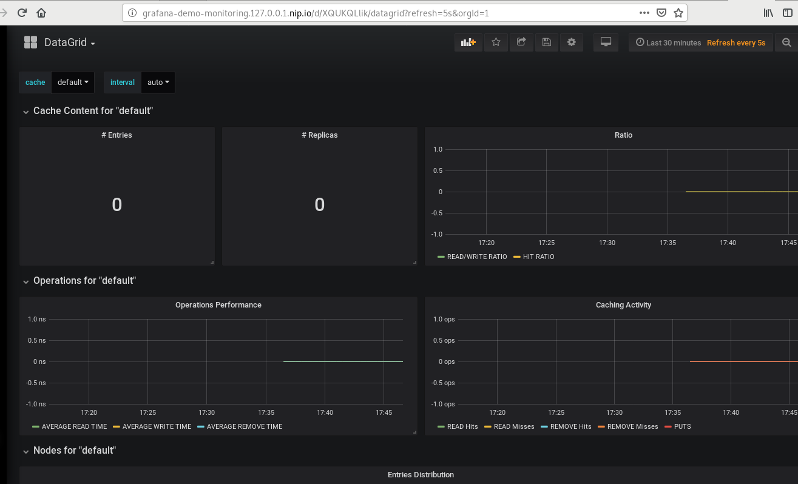

Integrating Prometheus/Grafana with Data Grid: Red Hat Data Grid (RHDG) for OpenShift
==============================================================
**Author:** Vladimir Blagojevic
**Technologies:** Infinispan, Data Grid, OpenShift  
**Summary:** Learn how to integrate RHDG/Prometheus/Grafana on Openshift platform  
**Target Product:** Red Hat Data Grid  
**Product Versions:** RHDG 7.3 or later


About This Quickstart
---------------------
This quickstart demonstrates how to integrate Data Grid with Prometheus and Grafana

Important notes
---------------
It is assumed that user running this quickstart has admin user priviledges for the Openshift cluster. If you are running minishift Openshift installation you can add admin user (if you have not already done so) with a command:

```bash
$ minishift addon enable admin-user
``` 

For more details about logging into Openshift cluster with admin user priviledges see 1-create-project-add-permissions.sh script.


Quickstart steps:

Step 1 - Create a new demo-monitoring project on Openshift
----------------------------------------------------------
  
  From your terminal window execute 1-create-project-add-permissions.sh script

   
```bash
$ 1-create-project-add-permissions.sh
```

   This short script will connect to a local Openshift cluster using system:admin credentials and assign necessary roles/priviledges to developer Openshift user. If you are unable to log in as admin user and assign necessary roles/proviledges to developer you will not be able to complete this quickstart.


Step 2 - Install Prometheus for demo-monitoring project on Openshift
--------------------------------------------------------------------

  From your terminal window execute 2-install-prometheus.sh script
   
```bash
$ 2-install-prometheus.sh 
```

   This script will deploy an instance of Prometheus to demo-monitoring project and assign necessary roles, bindings, and service accounts for integrating Prometheus with Data Grid. 
    

Step 3 - Install Data Grid (RHDG) for demo-monitoring project on Openshift
--------------------------------------------------------------------------

  From your terminal window execute 3-install-datagrid.sh script

```bash
$ 3-install-datagrid.sh 
```

   This script will deploy an instance of Data Grid to demo-monitoring project and create necessary service and service monitor accounts for integrating Data Grid and Prometheus.


Step 4 - Install Grafana for demo-monitoring project on Openshift
-----------------------------------------------------------------

  From your terminal window execute 4-install-grafana.sh script

```bash
$ 4-install-grafana.sh  
```

   This script will deploy an instance of Grafana to demo-monitoring project, install Prometheus datasource, and expose Grafana to admin user.

Step 5 - Add Datagrid Grafana dashboard
----------------------------------------

   This step we'll complete manually. 
  
   1) Log in to grafana web application using URL route retrieved with the following command:

```bash
$ oc get route grafana
```
   2) Take the output of the command above and paste it into your browser. Login with admin/admin credentials, select "Import" option

   

   3) In the following screen, select "Upload .json file"

   

   4) Select "datagrid-grafana-dashboard.json" file

   

   5) Finally select "Prometheus" datasource
  
   


   And voila, you are now taken to RHDG Grafana dashboard webpage where you can monitor your cluster metrics!


      

